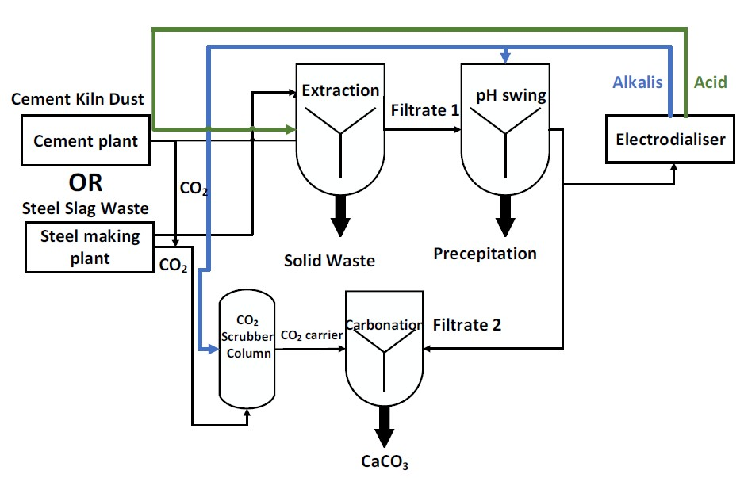
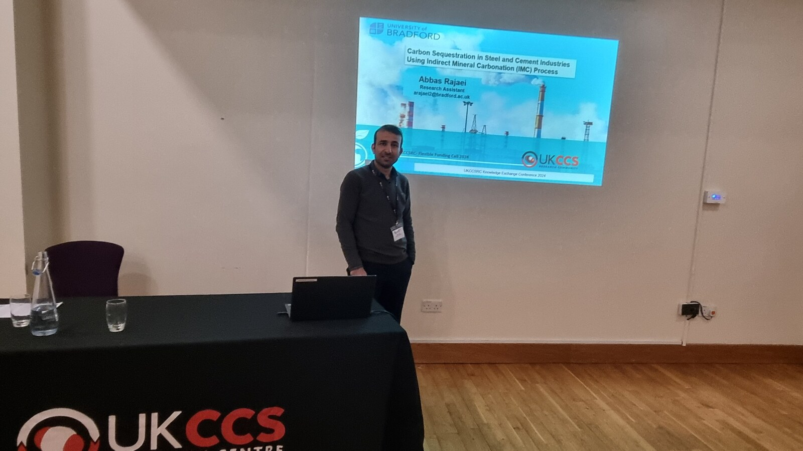
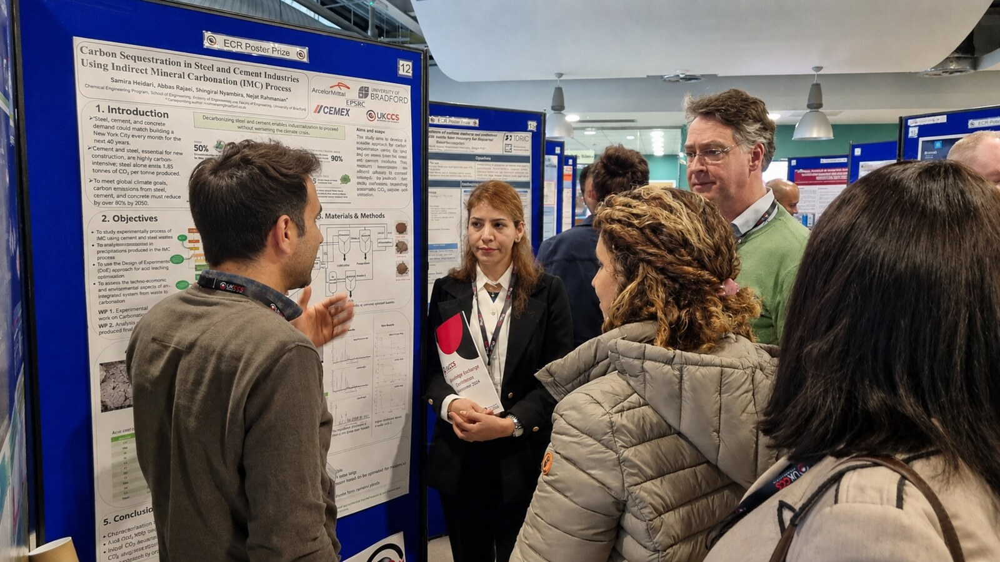

# Indirect CO₂ Mineralisation of Steel and Cement Wastes

### Experimental process development, selective calcium recovery, pH-swing purification, and CaCO₃ production



## Project overview

Steelmaking and cement production generate alkaline solid residues containing calcium- and magnesium-bearing phases. These materials are commonly managed as wastes, but their reactive metal content creates an opportunity for permanent CO₂ storage and by-product recovery.

Mineral carbonation converts CO₂ into thermodynamically stable carbonates such as CaCO₃ and MgCO₃. In the indirect route, reactive metals are first extracted into solution, co-extracted impurities are separated, and the purified solution is carbonated under controlled conditions.

This project developed an integrated indirect mineralisation process for steel slags and cement kiln dust. The work combined experimental design, selective calcium extraction, pH-swing purification, CO₂ absorption, carbonate precipitation, and product characterisation.

> **Industrial waste → characterisation → DOE-based extraction → pH-swing purification → CO₂ capture → carbonate generation → CaCO₃ mineralisation → product evaluation**

## Research question

> **Can calcium contained in steel and cement wastes be selectively extracted, purified, and converted into stable CaCO₃ through an integrated indirect CO₂ mineralisation process?**

The investigation examined how feedstock and extraction conditions affected calcium recovery and impurity dissolution; whether staged pH adjustment could remove Fe, Al, Mg, Mn, Si, and trace metals while retaining Ca²⁺; and whether captured CO₂ could be converted into carbonate and stored as recoverable CaCO₃.

## Project scope

Five industrial residues were investigated: basic oxygen furnace slag, blast-furnace slag, ladle slag, and two cement-kiln-dust samples. Approximately 150 extraction experiments were completed.

The public repository focuses on representative BOF slag and cement kiln dust case studies. Complete DOE matrices, industrial sample information, and selected analytical data are excluded because of confidentiality restrictions. Life-cycle assessment is also excluded because it was not performed by the author.

## Experimental work packages

### WP1: Feedstock characterisation

XRF and XRD were used to determine bulk composition and crystalline phases. ICP-OES and SEM-EDS supported the evaluation of dissolved species, solid products, and local morphology.

### WP2: DOE-based calcium extraction

Minitab design of experiments was used to examine leaching agent and concentration, temperature, contact time, and solid-to-liquid ratio. The principal responses were dissolved calcium concentration, calcium recovery, impurity extraction, acid utilisation, and calcium selectivity.

The programme included HCl, HNO₃, H₂SO₄, acetic acid, and selected salt-based extractants. NH₄Cl was treated as an inorganic salt extractant rather than an acid.

### WP3: pH-swing purification

Following extraction, 1 M NaOH was added gradually to increase the leachate pH. Solid-liquid separation was performed at selected stages to remove dissolved impurities while retaining calcium in solution.

> **M²⁺(aq) + 2OH⁻(aq) → M(OH)₂(s)**

> **M³⁺(aq) + 3OH⁻(aq) → M(OH)₃(s)**

The precipitation sequence depended on solution composition, oxidation state, pH, and hydroxide solubility.

### WP4: CO₂ capture and carbonate generation

CO₂ was absorbed into NaOH solution to produce an aqueous carbonate carrier:

> **2NaOH(aq) + CO₂(g) → Na₂CO₃(aq) + H₂O(l)**

Scrubber experiments examined NaOH concentration, solution volume, and gas-flow rate. A selected experiment using 20 L of 2 M NaOH at 3 L min⁻¹ achieved more than 97% CO₂ capture.

### WP5: Calcium carbonate mineralisation

The purified calcium-rich solution was reacted with the CO₂-derived carbonate:

> **Ca²⁺(aq) + CO₃²⁻(aq) → CaCO₃(s)**

For chloride-containing leachates:

> **CaCl₂(aq) + Na₂CO₃(aq) → CaCO₃(s) + 2NaCl(aq)**

The precipitate was separated, washed, dried, and characterised.

### WP6: Product and process evaluation

The final assessment considered calcium recovery, residual dissolved calcium, CaCO₃ yield, product morphology, CO₂ stored in the recovered carbonate, and storage capacity per tonne of waste.

## Material-specific extraction strategies

Steel slags and cement kiln dust behaved differently during extraction. Separate methods were therefore developed rather than applying one procedure to all feedstocks.

| Steel slags | Cement kiln dust |
|---|---|
| A fixed slag mass was reacted with a defined extractant volume. | CKD was added gradually to a fixed acid volume. |
| Temperature, time, reagent concentration, and solid-to-liquid ratio were varied through DOE. | Addition continued until the suspension reached approximately pH 3.0–4.0. |
| Calcium recovery was evaluated against Fe, Mg, Al, Mn, Cr, and Si extraction. | The pH endpoint controlled acid utilisation and the quantity of CKD accepted by the solution. |
| The method was suitable for granular and comparatively stable slag particles. | The method accounted for the high alkalinity and rapid neutralisation of fine CKD particles. |
| Selected leachates underwent staged pH adjustment. | HCl and HNO₃ routes were compared before pH-swing purification. |

For CKD, a final extraction pH of 3–4 was selected to balance calcium dissolution against impurity co-extraction. Lower pH increased impurity dissolution, whereas higher pH reduced calcium extraction and increased the possibility of calcium precipitation or recrystallisation.

## Public BOF case study

The public BOF dataset contains six selected HCl experiments from the larger DOE programme. Each experiment used 10 g of BOF slag and 150 mL of 2 M HCl.

| Experiment | Temperature | Contact time |
|---|---:|---:|
| BOF1 | Room temperature | 30 min |
| BOF2 | 60 °C | 30 min |
| BOF3 | 80 °C | 30 min |
| BOF4 | Room temperature | 60 min |
| BOF5 | 60 °C | 60 min |
| BOF6 | 80 °C | 60 min |

The BOF slag contained 51.79 wt% CaO, 18.65 wt% Fe, 11.30 wt% SiO₂, 3.97 wt% MgO, and 3.79 wt% MnO. Free CaO represented 14.90 wt% of the material. BOF6 produced the strongest combined extraction result, with 91.0% calcium recovery and 68.1% calcium selectivity.

The selected leachate entered the pH-swing process at approximately pH 1.7. Its pH was increased progressively to 5, 6, 7, 8, 9, and 10, with solid-liquid separation at the selected stages. Al- and Si-rich materials precipitated at lower pH, followed by Fe-, Mn-, and Mg-bearing solids as hydroxide availability increased.

The purified calcium solution was subsequently reacted with CO₂-derived Na₂CO₃. The public mineralisation workbook reports 19.76 g of recovered CaCO₃ per litre of purified solution and a recovered-product storage capacity of 130.4 kg CO₂ per tonne of BOF slag on the stated mass-balance basis.

[Open the BOF slag case study](bof-slag/)

## Public cement-kiln-dust case study

CKD was added gradually to HCl or HNO₃ while stirring at 600 rpm. Addition stopped when the final pH reached approximately 3.0–4.0. Centrifugation and vacuum filtration were then used to separate the leachate from the residual solid.

The HCl route produced 20,658.61 mg L⁻¹ dissolved Ca, whereas the HNO₃ route produced 20,072.08 mg L⁻¹. HNO₃ provided slightly higher calcium selectivity, with calcium representing 93.82% of the measured dissolved components compared with 93.29% for HCl. HCl produced the higher calcium concentration but also caused greater impurity dissolution.

The selected leachates were purified using three stages of 1 M NaOH addition. During purification, the solution was stirred at 200 rpm for 1 h and reached a final pH of approximately 9.0–9.5. The purified calcium-rich solution was then reacted with Na₂CO₃ generated from captured CO₂.

[Open the cement-kiln-dust case study](cement-kiln-dust/)

## Selected findings

| Area | Finding |
|---|---|
| Experimental programme | Approximately 150 extraction experiments were conducted across five steel and cement residues. |
| Process design | Different extraction procedures were required for steel slags and CKD because of their distinct alkalinity and neutralisation behaviour. |
| BOF extraction | The selected BOF6 condition achieved 91.0% calcium recovery and 68.1% calcium selectivity. |
| CKD extraction | Both HCl and HNO₃ produced calcium-rich leachates containing approximately 20 g L⁻¹ Ca. |
| Purification | Staged pH adjustment removed co-extracted metals while retaining a calcium-rich liquid for mineralisation. |
| CO₂ capture | More than 97% capture was achieved under the selected high-caustic scrubber condition. |
| Product formation | Purified calcium solutions were converted into recoverable CaCO₃ using carbonate generated from captured CO₂. |

## Research contribution

| Area | Work undertaken by Abbas Rajaei |
|---|---|
| Experimental design | Designed the experimental programme and Minitab DOE; developed distinct extraction procedures for steel slag and CKD. |
| Laboratory work | Conducted approximately 150 extraction experiments, pH-swing purification, CO₂ scrubbing, carbonate mineralisation, centrifugation, vacuum filtration, and staged solid-liquid separation. |
| Analysis | Interpreted ICP-OES, XRF, XRD, and SEM-EDS results and constructed calcium, carbonate, and CO₂ mass balances. |
| Communication | Presented results to academic and industrial stakeholders and prepared the final technical report. |

## Repository navigation

The repository is organised by material. Each experimental stage contains a technical README and the corresponding non-confidential datasets, calculations, photographs, or characterisation results.

- [Cement kiln dust study](cement-kiln-dust/)
- [Basic oxygen furnace slag study](bof-slag/)

```text
industrial-waste-co2-mineralization/
├── README.md
├── process-flow.jpg
├── figures/
│   └── research-dissemination/
├── cement-kiln-dust/
│   ├── README.md
│   ├── 01-raw-material-characterisation/
│   ├── 02-calcium-leaching/
│   ├── 03-impurity-removal/
│   ├── 04-mineral-carbonation/
│   └── 05-product-characterisation/
└── bof-slag/
    ├── README.md
    ├── 01-raw-material-characterisation/
    ├── 02-calcium-leaching/
    ├── 03-impurity-removal/
    ├── 04-mineral-carbonation/
    └── 05-product-characterisation/
```

## Research dissemination

Selected results were delivered as oral and poster presentations at the UKCCSRC Knowledge Exchange Conference 2024 in Sheffield. The research poster received third place in the conference poster competition.

<table>
  <tr>
    <td width="50%"></td>
    <td width="50%"></td>
  </tr>
  <tr>
    <td align="center"><strong>Oral presentation</strong><br>UKCCSRC Knowledge Exchange Conference 2024</td>
    <td align="center"><strong>Poster presentation</strong><br>UKCCSRC Knowledge Exchange Conference 2024</td>
  </tr>
</table>

- [Conference session summary](https://ukccsrc.ac.uk/blog_posts/kec-2024-parallel-1b-co2-storage-ecr-meeting-fund/)
- [Published conference abstract](https://ukccsrc.ac.uk/wp-content/uploads/2024/10/Abbas-Rajaei-KEC-2024-abstract.pdf)

## Confidentiality statement

This repository contains selected experimental results and representative datasets. The complete DOE matrices, statistical models, industrial sample identities, process data, and certain analytical results are excluded because of confidentiality restrictions. The six public BOF experiments represent only a small part of the complete experimental programme.

## Limitations

The reported work was conducted at laboratory scale. The results do not establish commercial feasibility. Further development should address reagent regeneration, water demand, solids handling, impurity management, continuous operation, and validation at larger scale.

## References

Jo, H., Lee, M.G., Park, J. and Jung, K.D. (2017) ‘Preparation of high-purity nano-CaCO₃ from steel slag’, *Energy*, 120, pp. 884–894. [https://doi.org/10.1016/j.energy.2016.11.140](https://doi.org/10.1016/j.energy.2016.11.140)

Renforth, P. (2019) ‘The negative emission potential of alkaline materials’, *Nature Communications*, 10, 1401. [https://doi.org/10.1038/s41467-019-09475-5](https://doi.org/10.1038/s41467-019-09475-5)

Sanna, A., Uibu, M., Caramanna, G., Kuusik, R. and Maroto-Valer, M.M. (2014) ‘A review of mineral carbonation technologies to sequester CO₂’, *Chemical Society Reviews*, 43, pp. 8049–8080. [https://doi.org/10.1039/C4CS00035H](https://doi.org/10.1039/C4CS00035H)

Sun, Y., Yao, M.S., Zhang, J.P. and Yang, G. (2011) ‘Indirect CO₂ mineral sequestration by steelmaking slag with NH₄Cl as leaching solution’, *Chemical Engineering Journal*, 173, pp. 437–445. [https://doi.org/10.1016/j.cej.2011.08.002](https://doi.org/10.1016/j.cej.2011.08.002)

## Researcher

**Abbas Rajaei**  
MSc Advanced Chemical Engineering, University of Bradford  
Affiliate Member, Institution of Chemical Engineers  
Early Career Researcher, UK Carbon Capture and Storage Research Centre  
[GitHub profile](https://github.com/abbasrajaei)
