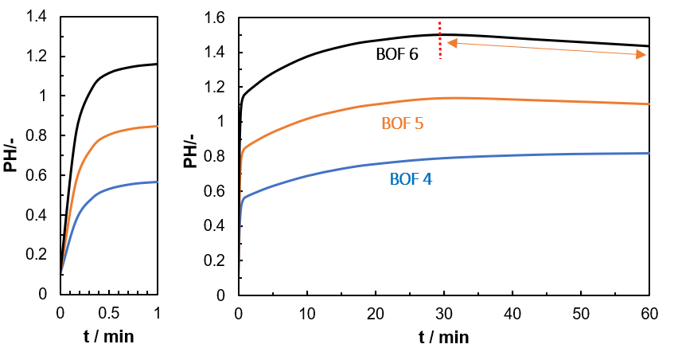

# Hydrochloric-acid extraction from BOF slag

## Objective

Calcium was extracted from basic oxygen furnace (BOF) slag using 2 M HCl. The objective was to examine the effects of temperature and contact time on calcium recovery and its selectivity relative to Fe, Mg, Al, Mn, and Cr. The resulting leachate was intended for pH-swing purification followed by CO₂ mineralisation.

## Scope and data status

This public analysis is limited to selected BOF-slag experiments and HCl extraction. Results for other slags, extraction agents, and process parameters are excluded because of non-disclosure agreement restrictions.

## Experimental conditions

Each test used 10 g of BOF slag and 150 mL of 2 M HCl solution, corresponding to a solid-to-liquid ratio of 1:15 g mL⁻¹.

| Test | Temperature | Contact time |
|---|---:|---:|
| BOF1 | Room temperature | 30 min |
| BOF2 | 60 °C | 30 min |
| BOF3 | 80 °C | 30 min |
| BOF4 | Room temperature | 60 min |
| BOF5 | 60 °C | 60 min |
| BOF6 | 80 °C | 60 min |

## Calculation method

ICP-OES concentrations are corrected for the dilution applied during sample preparation:

**Equation (1)**

```math
C_i = C_{i,\mathrm{ICP}} \, DF
```

where $C_i$ is the corrected concentration of element $i$ (mg L⁻¹), $C_{i,\mathrm{ICP}}$ is the measured concentration (mg L⁻¹), and $DF$ is the dilution factor.

The elemental mass transferred to the leachate is calculated as:

**Equation (2)**

```math
m_{i,\mathrm{ext}} = C_i \, V
```

where $m_{i,\mathrm{ext}}$ is the extracted elemental mass (mg) and $V$ is the leachate volume (L).

For elements reported by XRF as oxides, the initial elemental mass is calculated from the oxide mass fraction:

**Equation (3)**

```math
m_{i,0} = m_{\mathrm{slag}} \, 1000 \, w_{\mathrm{oxide}} \, \frac{n_i M_i}{M_{\mathrm{oxide}}}
```

where $m_{\mathrm{slag}}$ is the initial slag mass (g), $w_{\mathrm{oxide}}$ is the oxide mass fraction, $n_i$ is the number of atoms of element $i$ in the oxide formula, and $M$ denotes molar mass.

For calcium reported as CaO:

**Equation (4)**

```math
m_{\mathrm{Ca},0} = m_{\mathrm{slag}} \, 1000 \, w_{\mathrm{CaO}} \, \frac{40.078}{56.077}
```

Elemental recovery is the proportion of the initial elemental inventory transferred to the leachate:

**Equation (5)**

```math
R_i \, (\%) = \frac{m_{i,\mathrm{ext}}}{m_{i,0}} \, 100
```

Calcium selectivity is calculated on an extracted-mass basis:

**Equation (6)**

```math
S_{\mathrm{Ca}} \, (\%) = \frac{m_{\mathrm{Ca,ext}}}{m_{\mathrm{Ca,ext}} + m_{\mathrm{Fe,ext}} + m_{\mathrm{Mg,ext}} + m_{\mathrm{Al,ext}} + m_{\mathrm{Mn,ext}} + m_{\mathrm{Cr,ext}}} \, 100
```

Recovery describes the fraction of the initial elemental inventory transferred from the slag to the liquid phase. Selectivity describes the proportion of calcium within the combined extracted mass of Ca, Fe, Mg, Al, Mn, and Cr.

## pH evolution



*pH profiles for BOF4, BOF5, and BOF6,Time-pH curves obtained from leaching BOFS.

- The pH increased sharply during the first minute, consistent with rapid H⁺ consumption and dissolution of reactive BOF phases. BOF6 showed the largest increase, indicating that the higher extraction temperature accelerated the initial reaction.
- After the initial stage, the pH approached a plateau as the dissolution rate decreased. The slight later decline may reflect continued solution equilibration involving dissolved silicic acid and condensation of silanol groups into silica-rich material. These reactions can be represented as:

**Silicic-acid deprotonation**

```math
\mathrm{Si(OH)_4 + OH^- \rightleftharpoons SiO(OH)_3^- + H_2O}
```

**Silanol condensation**

```math
2\,{\equiv}\mathrm{Si{-}OH} \rightleftharpoons {\equiv}\mathrm{Si{-}O{-}Si}{\equiv} + \mathrm{H_2O}
```

The pH trend alone does not confirm silica polymerisation; direct analysis of dissolved silicon or the residual solid would be required.

## Main findings from the modelled dataset

- BOF6 gave the highest calcium recovery. At 80 °C and 60 min, calcium recovery reached 91.0%, with a calcium selectivity of 68.1%.
- High temperature improved calcium extraction. BOF3 reached 82.0% recovery after 30 min at 80 °C; extending the contact time to 60 min increased the modelled recovery to 91.0%.
- Contact time did not have a consistent effect at lower temperatures. Increasing the extraction time from 30 to 60 min reduced calcium recovery at room temperature and 60 °C within this dataset.
- BOF5 produced the lowest calcium recovery: 60.2% at 60 °C and 60 min.
- High recovery did not produce a pure calcium leachate. Under the BOF6 condition, Fe, Mg, Al, Mn, and Cr represented 31.9% of the combined extracted mass of the six reported metals. Purification is therefore required before carbonation.

## Files

- [BOF HCl extraction dataset](HCl-extraction-data.xlsx): experimental design, mass-balanced ICP concentrations, recovery, and selectivity.
- [BOF composition before and after extraction](before-after-extraction.xlsx)
