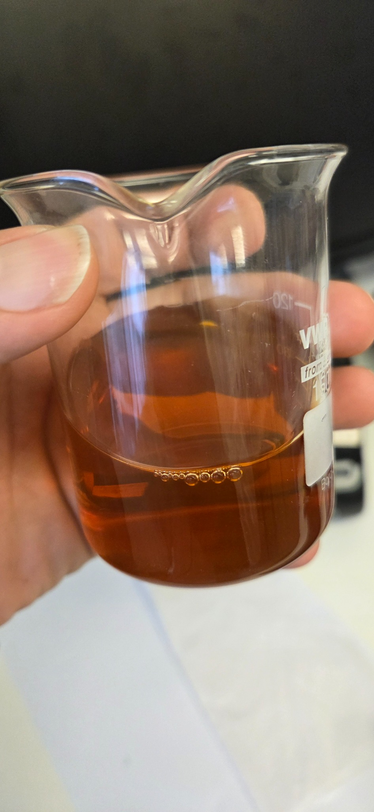
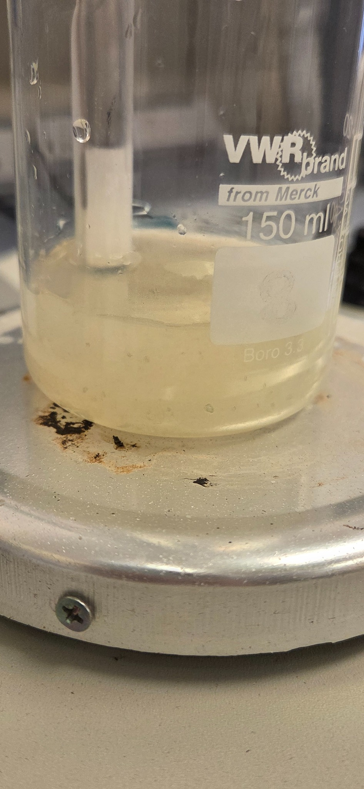
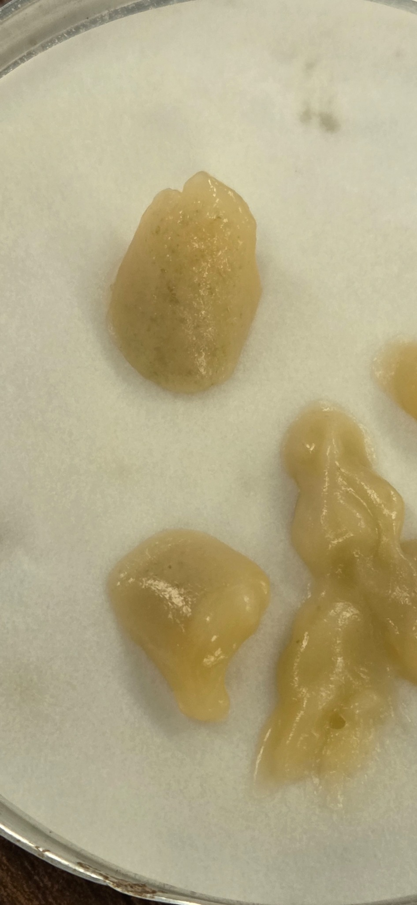
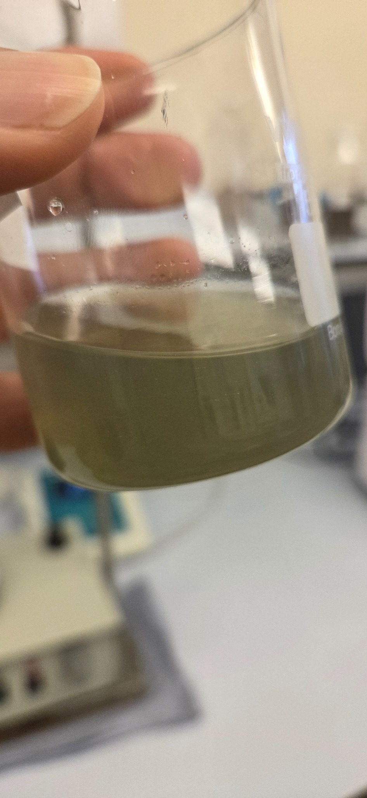
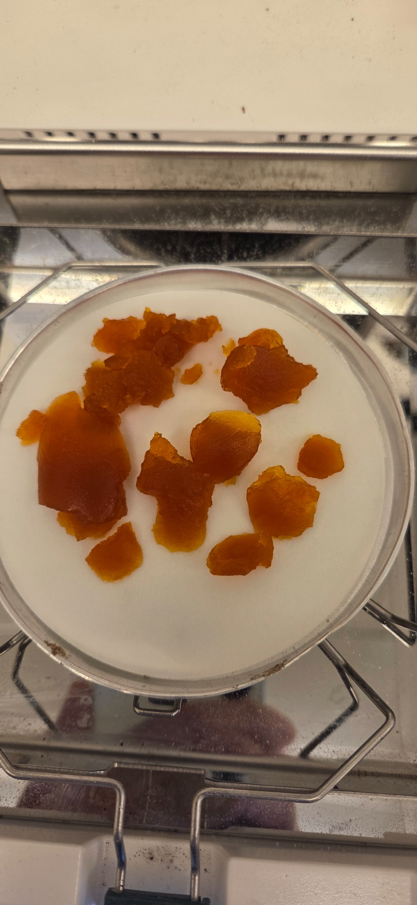

# Phase II: Staged pH-Swing Purification of BOF Slag Leachate

## Objective

The pH-swing stage was used to remove dissolved impurities from the calcium-rich solution obtained after HCl leaching of basic oxygen furnace (BOF) slag. The pH was increased stepwise so that Al, Si, Fe, Mn, and Mg could be progressively removed while most of the dissolved Ca²⁺ remained in solution for the subsequent carbonation stage.

This directory contains selected results from the BOF6 pH-swing experiment. Because of confidentiality restrictions, only BOF data obtained using HCl are reported.

## Experimental procedure

The initial BOF6 leachate had a pH of approximately 1.7. A 1 M NaOH solution was added progressively to increase the pH. At each selected pH, the suspension was separated into solid and liquid phases, allowing the precipitate and residual leachate to be analysed independently.

The main pH values investigated were 5, 6, 7, 8, 9, and 10. An additional observation at approximately pH 3.5 was used to examine the onset of precipitation at lower pH.

For divalent metal ions, hydroxide precipitation can be represented by:

> **M²⁺(aq) + 2OH⁻(aq) ⇌ M(OH)₂(s)**

where M²⁺ may represent Fe²⁺, Mn²⁺, Mg²⁺, or other divalent metal ions.

For trivalent metal ions:

> **M³⁺(aq) + 3OH⁻(aq) ⇌ M(OH)₃(s)**

where M³⁺ may represent Al³⁺ or Fe³⁺.

The actual precipitation behaviour depends on metal concentration, oxidation state, pH, solution composition, complex formation, and the solubility of the corresponding solid phase.

## Initial BOF6 leachate

The untreated leachate was clear and orange-brown. This colour indicates the presence of dissolved iron species in the strongly acidic solution. Calcium and several minor elements were also transferred from the BOF slag into the aqueous phase during HCl extraction.

The colour provides evidence of dissolved iron but does not establish its oxidation state.

  

<em>Initial BOF6 leachate at pH 1.7, showing the clear orange-brown solution before pH adjustment.</em>

## Low-pH Al and Si precipitation

The solution became pale yellow-white and visibly turbid as the pH approached 3.5. This observation is consistent with the beginning of Al(OH)₃ formation and silica reprecipitation. A minor contribution from Fe(III)-bearing hydroxide or oxyhydroxide phases may account for the pale yellow tint.

Aluminium hydroxide precipitation can be represented by:

> **Al³⁺(aq) + 3OH⁻(aq) ⇌ Al(OH)₃(s)**

Dissolved silicic acid can polymerise and form hydrated silica:

> **nSi(OH)₄(aq) → (SiO₂)ₙ·mH₂O(s) + (2n − m)H₂O(l)**

The observed material should therefore be described as an Al-Si-rich precipitate rather than pure Al(OH)₃.

  

<em>Pale yellow-white turbidity observed near pH 3.5 during the onset of Al-Si precipitation.</em>

The precipitate collected near pH 5 had a white to pale beige colour and a translucent, gelatinous structure. These characteristics are consistent with amorphous Al(OH)₃ mixed with hydrated silica gel.

Both phases can be poorly crystalline. Consequently, XRD may display weak or broad features even when Al and Si are enriched in the solid. ICP-OES measurements of the liquid phase are required to quantify Al and Si removal, while SEM-EDS can determine their enrichment in the separated precipitate.

  

<em>White to pale beige gelatinous material recovered near pH 5.</em>

## Iron precipitation

The formation of a pale olive-green suspension provides strong visual evidence of Fe(II)-rich hydroxide precipitation. Fresh Fe(OH)₂ is characteristically pale green and forms according to:

> **Fe²⁺(aq) + 2OH⁻(aq) ⇌ Fe(OH)₂(s)**

Mixed Fe(II)-Fe(III) hydroxide phases may also form under partially oxidising conditions. The observed precipitation interval agrees with reported BOF-slag pH-swing behaviour, in which extensive Fe removal occurs between pH 7 and 8.

  

<em>Pale olive-green Fe-rich suspension observed between pH 7 and 8.</em>

## Oxidation and drying of the iron-rich precipitate

The initially green Fe-rich precipitate became orange-brown after filtration, exposure to air, and drying. This colour change is consistent with oxidation of Fe(II) hydroxide to Fe(III)-bearing hydroxides:

> **4Fe(OH)₂(s) + O₂(g) + 2H₂O(l) → 4Fe(OH)₃(s)**

Subsequent dehydration may produce iron oxyhydroxide phases:

> **Fe(OH)₃(s) → FeOOH(s) + H₂O(l)**

The dried material should therefore be described as an **iron-rich hydroxide/oxyhydroxide precipitate**, rather than pure Fe(OH)₂. Possible phases include poorly crystalline ferrihydrite and goethite-type FeOOH. XRD, SEM-EDS, or complementary spectroscopic analysis would be required for definitive phase identification.

  

<em>Orange-brown iron-rich precipitate after filtration, exposure to air, and drying.</em>

## Expected precipitation sequence

| pH region | Dominant expected removal | Observed colour and appearance | Interpretation |
| --- | --- | --- | --- |
| Approximately 1.7 | Elements remain dissolved | Clear orange-brown solution | Acidic BOF leachate containing dissolved Fe, Ca, and other extracted elements |
| 3.5–5 | Al and Si | Pale yellow-white suspension followed by a white or pale beige gel | Al(OH)₃ and hydrated silica-rich precipitate |
| 6 | Limited additional removal | No distinctive photograph assigned | Transition between Al-Si and Fe precipitation |
| 7–8 | Fe | Pale olive-green suspension | Fe(OH)₂ and possible mixed Fe(II)-Fe(III) phases |
| 8–9 | Mn and remaining Fe | No photograph assigned conclusively | Mn hydroxide formation and possible co-precipitation with residual Fe |
| 10 | Mg | No photograph assigned conclusively | Mg(OH)₂, which is generally white or cream |
| Up to pH 10 | Ca predominantly remains dissolved | Ca-rich final leachate | Solution retained for subsequent mineral carbonation |

Mn precipitation may be represented by:

> **Mn²⁺(aq) + 2OH⁻(aq) ⇌ Mn(OH)₂(s)**

Fresh Mn(OH)₂ is generally white or pale in colour but can become brown following oxidation in air.

Magnesium hydroxide precipitation can be represented by:

> **Mg²⁺(aq) + 2OH⁻(aq) ⇌ Mg(OH)₂(s)**

Mg(OH)₂ generally becomes significant at a higher pH than Fe and Mn hydroxides. Calcium remains comparatively soluble under the investigated purification conditions.

The photographs support the proposed precipitation sequence, but visual appearance alone cannot establish the chemical composition of each solid. The assignments must be checked against ICP-OES measurements of the residual liquid and, where available, SEM-EDS and XRD results for the recovered precipitates.

## Main observations

- Low-pH neutralisation produced a white to pale beige gelatinous material, consistent with combined aluminium hydroxide and hydrated silica precipitation between pH 3.5 and 5.
- Iron precipitation produced a pale olive-green suspension near pH 7–8. The recovered material became orange-brown during air exposure and drying because of Fe(II) oxidation.

Calcium was retained predominantly in the liquid phase during impurity removal, providing a purified Ca-rich solution for subsequent reaction with captured CO₂ and production of CaCO₃.

The carbonation reaction is:

> **Ca²⁺(aq) + CO₃²⁻(aq) → CaCO₃(s)**

## Data files

The accompanying Excel files contain the BOF6 ICP-OES results, residual elemental fractions, calculated precipitation efficiencies, and pH-dependent charts.

The residual dissolved fraction was calculated as:

> **Residual fraction (%) = [C(pH) ÷ C(initial)] × 100**

The cumulative precipitation efficiency was calculated as:

> **Precipitation efficiency (%) = [1 − C(pH) ÷ C(initial)] × 100**

where **C(initial)** is the elemental concentration in the initial BOF6 leachate and **C(pH)** is the residual dissolved concentration measured after solid-liquid separation at the specified pH.

The incremental precipitation occurring between two consecutive pH stages can be calculated as:

> **Incremental precipitation (%) = {[C(previous) − C(current)] ÷ C(initial)} × 100**

These calculations describe removal from the liquid phase. They do not prove that a pure single-element hydroxide was formed because co-precipitation, adsorption, and incorporation into mixed amorphous phases may also occur.

## References

Benali, O., Abdelmoula, M., Refait, P. and Génin, J.M.R. (2001) ‘Effect of orthophosphate on the oxidation products of Fe(II)-Fe(III) hydroxycarbonate: the transformation of green rust to ferrihydrite’, *Geochimica et Cosmochimica Acta*, 65(11), pp. 1715–1726. Available at: [https://doi.org/10.1016/S0016-7037(01)00556-7](https://doi.org/10.1016/S0016-7037\(01\)00556-7).

Triwigati, P.T., Noh, S., Sim, G., Lee, J., Kim, E., Moon, S. and Park, Y. (2025) ‘Investigation of pH swing carbon mineralization for valuable element recovery and CO₂ sequestration using steelmaking slag’, *Journal of Industrial and Engineering Chemistry*, 147, pp. 658–667. Available at: [https://doi.org/10.1016/j.jiec.2024.12.057](https://doi.org/10.1016/j.jiec.2024.12.057).
