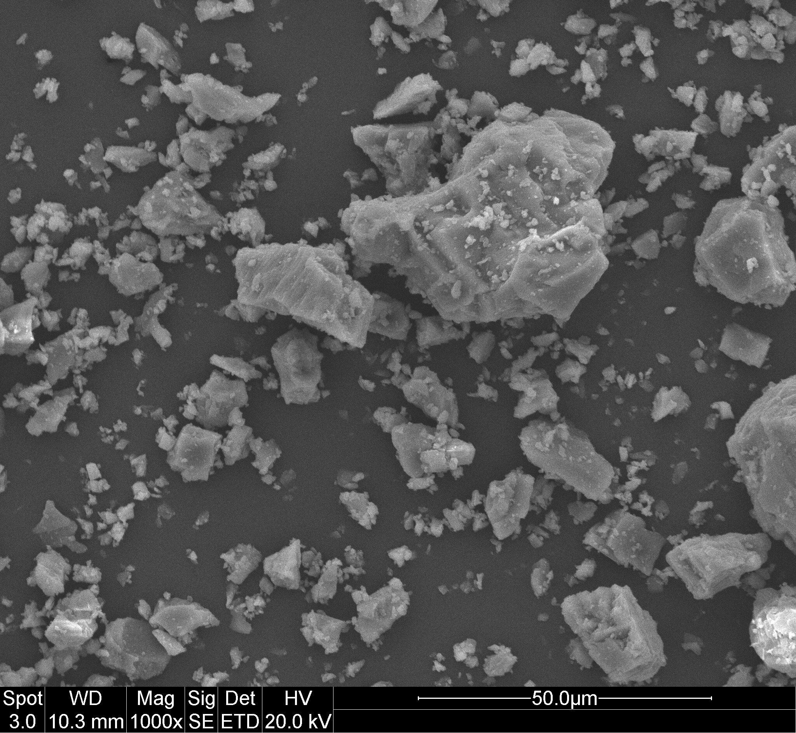
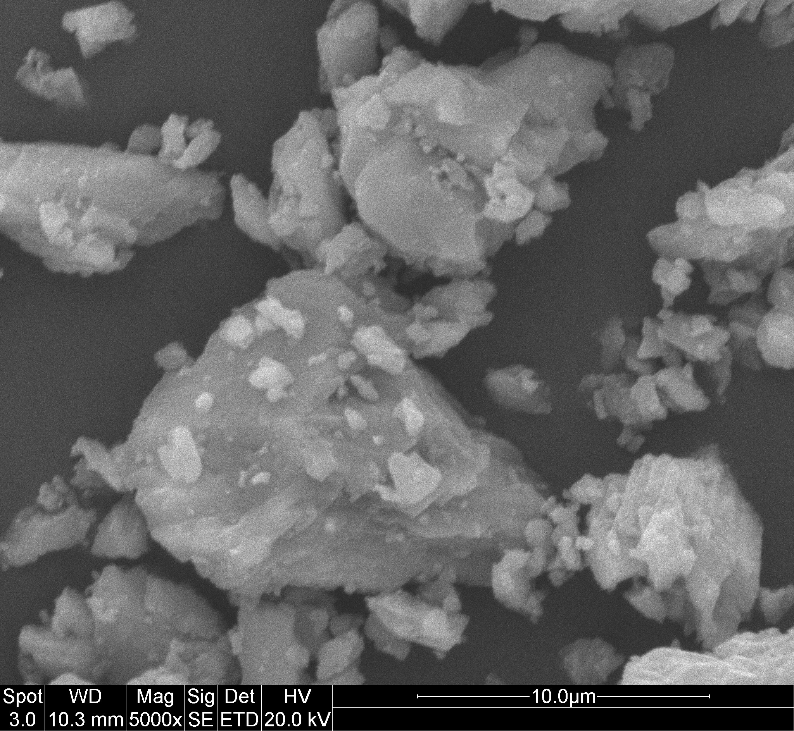

# BOF CaCO₃ Product Characterisation

## Overview

The final solid obtained after mineralisation of the purified basic oxygen furnace (BOF) slag leachate was examined by scanning electron microscopy (SEM). The Ca-rich solution was reacted with carbonate according to:

> **Ca²⁺(aq) + CO₃²⁻(aq) → CaCO₃(s)**

## SEM images

### 1,000× magnification

**Figure 1.** General particle distribution at 1,000× magnification. Scale bar: 50 µm.

### 5,000× magnification

**Figure 2.** Surface morphology and attached fine particles at 5,000× magnification. Scale bar: 10 µm.

## Main observations

- The product contained angular, faceted, and strongly agglomerated particles with a broad apparent size distribution.
- Blocky and partly rhombohedral features were compatible with calcite-like CaCO₃ morphology, although SEM alone cannot establish the crystalline phase.
- Fine particles attached to larger particles suggest nucleation, crystal growth, and aggregation during precipitation.
- No dominant spherical vaterite-like or needle-shaped aragonite-like particle population was observed in the examined fields.
- The product was a heterogeneous micron-scale precipitate rather than a uniform nano-CaCO₃ powder.
