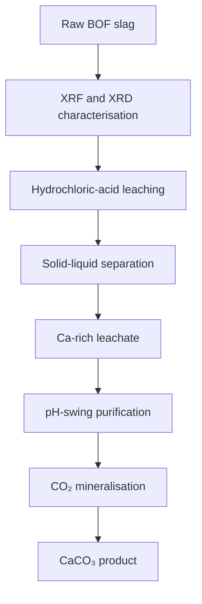

# Indirect CO₂ mineralisation using basic oxygen furnace slag

## Overview

This study examined basic oxygen furnace (BOF) slag as a calcium source for indirect CO₂ mineralisation. The published work covers raw-material characterisation and selected hydrochloric-acid leaching experiments.

BOF slag contains a large calcium inventory together with substantial iron and other metal-bearing phases. Acid extraction can transfer calcium into solution, but co-extraction of Fe, Mg, Al, Mn, and Cr makes downstream purification necessary before CaCO₃ precipitation.

## Study sequence

## Public scope

The public BOF dataset is limited to selected HCl extraction experiments. Results for other slags, extraction agents, and process parameters are excluded because of non-disclosure agreement restrictions.

## Repository contents

- [Raw-material characterisation](01-raw-material-characterisation/)
- [Calcium leaching](02-calcium-leaching/)
