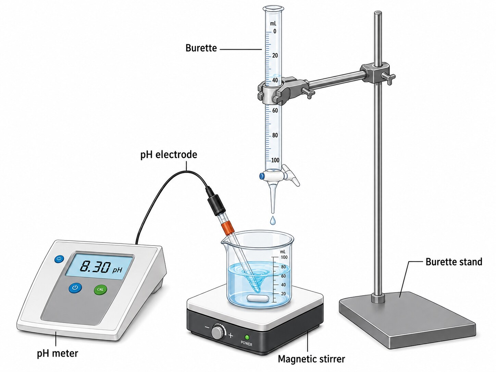

# Phase II: Impurity Removal by pH-Swing Precipitation

## Objective

Phase II was used to remove metallic impurities co-extracted with Ca²⁺ during the low-pH leaching of cement kiln dust. The objective was to precipitate Fe, Al, Mg, and other dissolved impurities while retaining Ca²⁺ in the aqueous phase for subsequent mineral carbonation.

## Experimental method

The supernatant recovered from Phase I was stirred at 200 rpm while 1 M NaOH was added gradually in three stages. The final pH was controlled at approximately 9.0–9.5, and the suspension was stirred for 1 h.

Increasing the pH decreased the solubility of the co-extracted metal ions, causing them to precipitate as hydroxides:

M²⁺(aq) + 2OH⁻(aq) → M(OH)₂(s)

M³⁺(aq) + 3OH⁻(aq) → M(OH)₃(s)

The precipitated solids were removed by solid–liquid separation. Both the purified supernatant and the recovered precipitate were analysed by ICP-OES. The purified Ca²⁺-rich solution was retained for the subsequent carbonation phase.

## Experimental setup

The setup consisted of a stirred vessel, magnetic stirrer, pH electrode, and controlled NaOH addition system.

## Main findings

- The grouped impurity concentration decreased from 1,131.59 mg L⁻¹ to below the ICP-OES detection limit for the HCl-derived solution and from 993.75 mg L⁻¹ to below the detection limit for the HNO₃-derived solution. This confirms effective impurity removal under the selected pH-swing conditions.

- The recovered precipitates were dominated by the grouped impurities, which accounted for 81.34% of the HCl-derived solid and 80.05% of the HNO₃-derived solid. Calcium accounted for 13.70% and 13.00%, respectively, confirming that some calcium was co-precipitated during purification.

The Ca concentrations in the purified supernatants were 20,980.38 mg L⁻¹ for HCl and 20,623.76 mg L⁻¹ for HNO₃. These concentration values must not be interpreted directly as calcium retention because NaOH addition changed the liquid volume. A mass-based retention calculation requires the solution volumes before and after purification.

Results reported as below the limit of detection were treated as censored analytical results and were not assigned a value of zero.

## Provided files

- [`CKD_Phase_II_impurity_removal.xlsx`](data/CKD_Phase_II_impurity_removal.xlsx): complete Phase II dataset, including the entering leachate, purified supernatant, precipitate composition, and editable result charts.
- [`Impurities_before_after_pH_swing.xlsx`](data/Impurities_before_after_pH_swing.xlsx): comparison of grouped impurity concentrations before and after purification.
- [`Phase_II_precipitate_composition.xlsx`](data/Phase_II_precipitate_composition.xlsx): ICP-OES concentrations, reported component distributions, and an editable precipitate-composition chart.

## Analytical scope

The grouped impurities comprise Zn, Fe, Ti, Pb, Cu, Mg, Al, Sn, Cr, Si, and S.
