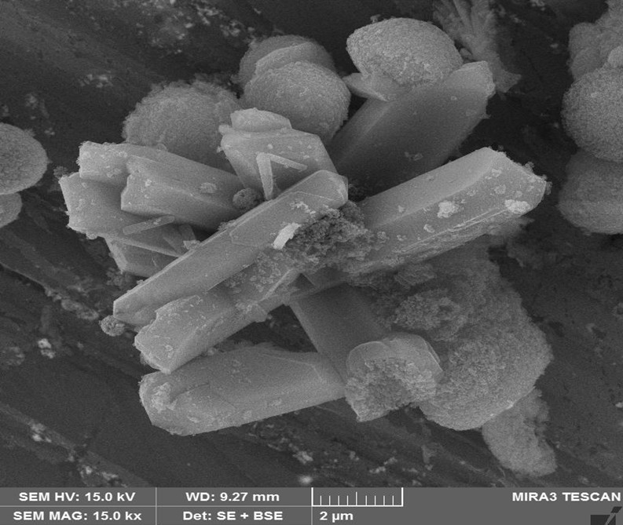
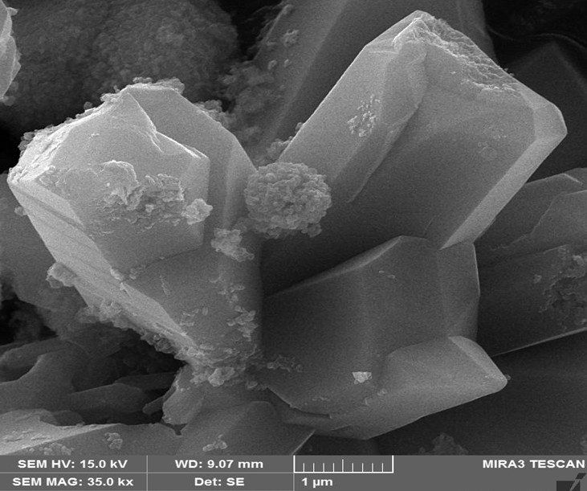

# Final CKD-Derived CaCO₃ Product Characterisation

This folder contains SEM micrographs of the final solid product recovered after mineral carbonation of the purified CKD-derived calcium solution.

## SEM micrographs

*Final CKD-derived CaCO₃ product at 15,000× magnification; scale bar: 2 µm.*

*Final CKD-derived CaCO₃ product at 35,000× magnification; scale bar: 1 µm.*
