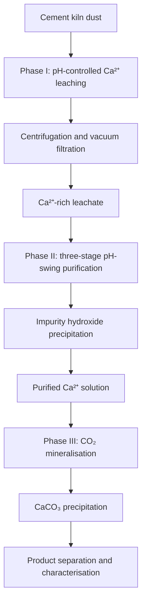

# Indirect CO₂ mineralisation using cement kiln dust

## Overview

This study investigated calcium recovery from cement kiln dust (CKD) and its conversion into calcium carbonate through indirect CO₂ mineralisation. Hydrochloric acid and nitric acid were compared as extraction agents.

The process consisted of three phases:

1. pH-controlled Ca²⁺ leaching from CKD
2. pH-swing removal of co-extracted impurities
3. CO₂ mineralisation and CaCO₃ recovery

The extraction method differed from that used for BOF slag. CKD was progressively added to a fixed volume of acidic solution, and the final suspension pH was used as the stopping criterion. This approach was selected to achieve high calcium extraction while limiting the dissolution of Fe, Al, Mg, and other impurities.

## Process sequence



## Phase I: calcium leaching

CKD was progressively added to hydrochloric acid or nitric acid under continuous stirring at 600 rpm. Because CKD is alkaline, its addition gradually increased the suspension pH. CKD addition was stopped when the final pH reached 3.0–4.0.

This pH range was selected to balance calcium extraction against impurity dissolution. At lower pH, Fe, Al, Mg, and other metallic species can dissolve together with Ca²⁺. At higher pH, calcium extraction becomes incomplete, and dissolved calcium may be retained through precipitation or recrystallisation of calcium-bearing phases.

The suspension was centrifuged and then vacuum-filtered to remove unreacted CKD and secondary solids. The filtrate was analysed by ICP-OES for Ca, K, Si, S, Pb, Na, Fe, Mg, Al, Cu, Ti, Zn, Cr, and Sn.

The principal dissolution reactions are represented by:

```math
\mathrm{MO(s) + 2H^+(aq) \rightarrow M^{2+}(aq) + H_2O(l)}
```

```math
\mathrm{M_2O_3(s) + 6H^+(aq) \rightarrow 2M^{3+}(aq) + 3H_2O(l)}
```

```math
\mathrm{CaCO_3(s) + 2H^+(aq) \rightarrow Ca^{2+}(aq) + CO_2(g) + H_2O(l)}
```

## Phase II: impurity removal

The Phase I leachate contained dissolved Ca²⁺ together with co-extracted metallic impurities. A 1 M NaOH solution was added gradually through a three-stage pH-swing process. The solution was stirred at 200 rpm for 1 h, and the final pH was controlled at approximately 9.0–9.5.

Increasing the pH reduced the solubility of Fe, Al, Mg, and other metal ions, causing their precipitation as metal hydroxides:

```math
\mathrm{M^{2+}(aq) + 2OH^-(aq) \rightarrow M(OH)_2(s)}
```

```math
\mathrm{M^{3+}(aq) + 3OH^-(aq) \rightarrow M(OH)_3(s)}
```

The precipitated impurities were removed by solid–liquid separation. Both the recovered solids and the purified supernatant were analysed by ICP-OES. The remaining Ca²⁺-rich solution was retained for mineral carbonation.

## Phase III: CO₂ mineralisation

CO₂ was absorbed into an aqueous NaOH solution to produce dissolved carbonate species. The carbonate-rich solution was then reacted with the purified Ca²⁺ solution obtained from Phase II.

Under alkaline conditions, carbonate formation can be represented by:

```math
\mathrm{CO_2(aq) + OH^-(aq) \rightarrow HCO_3^-(aq)}
```

```math
\mathrm{HCO_3^-(aq) + OH^-(aq) \rightarrow CO_3^{2-}(aq) + H_2O(l)}
```

Calcium carbonate was precipitated through:

```math
\mathrm{Ca^{2+}(aq) + CO_3^{2-}(aq) \rightarrow CaCO_3(s)}
```

The solid product was separated from the liquid and characterised using XRD and SEM–EDS.

## Main findings

- **Both acids produced calcium-rich leachates.** Dissolved Ca concentrations reached 20,658.61 mg L⁻¹ with HCl and 20,072.08 mg L⁻¹ with HNO₃.
- **HCl produced the higher dissolved Ca concentration.** The HCl leachate contained 586.53 mg L⁻¹ more Ca than the HNO₃ leachate.
- **HNO₃ gave slightly better calcium selectivity.** Calcium accounted for 93.82% of the measured dissolved components in the HNO₃ leachate, compared with 93.29% for HCl.
- **HCl caused greater impurity dissolution.** The combined impurity concentration was 1,131.59 mg L⁻¹ for HCl and 993.75 mg L⁻¹ for HNO₃.
- **The residual solids supported the liquid-phase results.** Calcium accounted for 3.27% of the measured components in the HCl residue and 5.81% in the HNO₃ residue. Less calcium therefore remained after HCl extraction.
- **The pH-swing stage removed the measured impurities to below the ICP-OES detection limit.** Ca remained at 20,980.38 mg L⁻¹ in the HCl-derived solution and 20,623.76 mg L⁻¹ in the HNO₃-derived solution.
- **Some calcium was transferred to the Phase II solids.** Calcium represented 13.70% and 13.00% of the measured components in the HCl- and HNO₃-derived impurity precipitates, respectively.
- **Mineral carbonation removed most of the dissolved calcium.** After Phase III, the remaining Ca concentrations were 22.44 mg L⁻¹ for the HCl route and 72.58 mg L⁻¹ for the HNO₃ route.
- **Calcite was the principal crystalline carbonation product.** XRD confirmed calcite formation for both extraction routes. The acid used during Phase I did not alter the final CaCO₃ polymorph under the applied carbonation conditions.

## Repository contents

- [Raw-material characterisation](01-raw-material-characterisation/)
- [Calcium leaching](02-calcium-leaching/)
