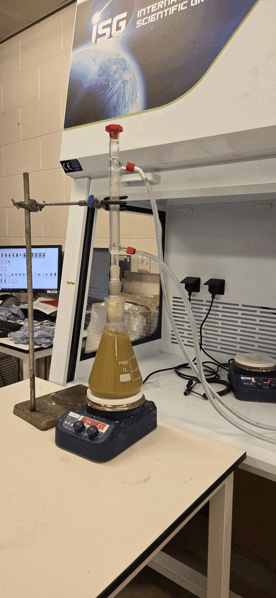

# Phase I: calcium leaching from cement kiln dust

## Overview

This phase examined calcium extraction from cement kiln dust (CKD) using hydrochloric acid and nitric acid. CKD was added progressively to the acidic solution under continuous stirring, and addition was stopped when the suspension reached the target pH range of 3.0–4.0.

After leaching, the suspension was centrifuged and vacuum-filtered. The liquid supernatant and residual solid were analysed separately to compare calcium extraction and the distribution of the measured components.

## Experimental setup

The setup consisted of a stirred extraction flask fitted with a water-cooled condenser. The condenser limited evaporative losses during the experiment.

## Data files

- [Phase I supernatant composition](data/Phase_I_supernatant_composition.xlsx): ICP-OES composition of the liquid fraction after CKD leaching, with separate data and results sheets.
- [Phase I residual-solid composition](data/Phase_I_residual_solid_composition.xlsx): composition of the solid residue remaining after HCl and HNO₃ leaching, with separate data and results sheets.

The distribution values in these workbooks describe the compositional share of each component within the analysed fraction. They do not represent elemental recovery from the initial CKD.

## Main observations

- Both acids produced calcium-rich supernatants. Dissolved Ca concentrations were 20,658.61 mg L⁻¹ for HCl and 20,072.08 mg L⁻¹ for HNO₃.
- Calcium represented 93.29% of the measured dissolved components in the HCl supernatant and 93.82% in the HNO₃ supernatant.
- Residual calcium represented 3.27% of the measured components after HCl leaching and 5.81% after HNO₃ leaching. The lower residual calcium fraction after HCl treatment is consistent with greater calcium removal from the solid.

These results show that HCl produced a slightly higher dissolved calcium concentration, whereas HNO₃ provided slightly higher calcium selectivity within the measured liquid-phase composition.
